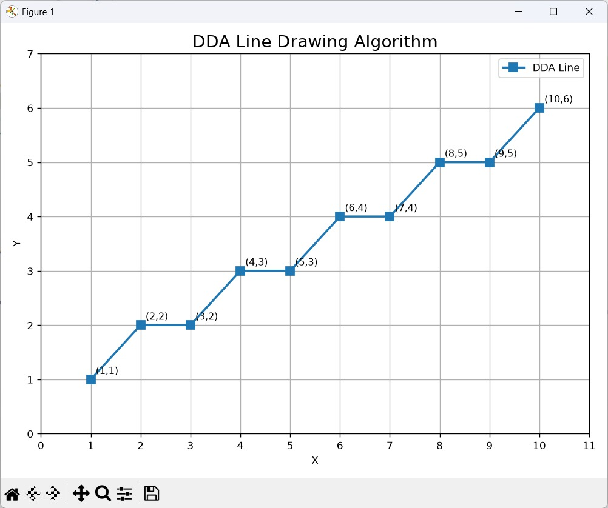
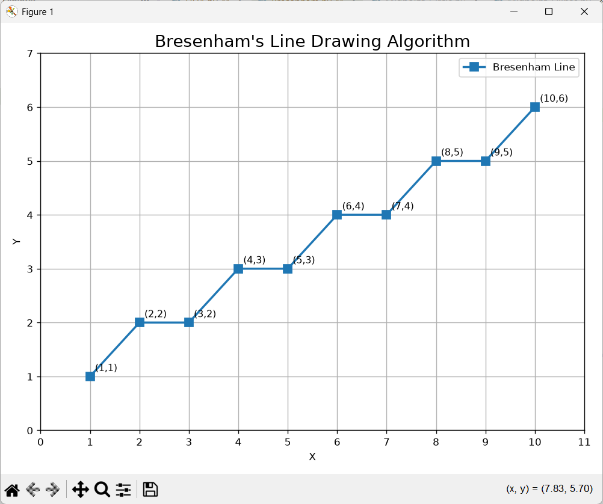
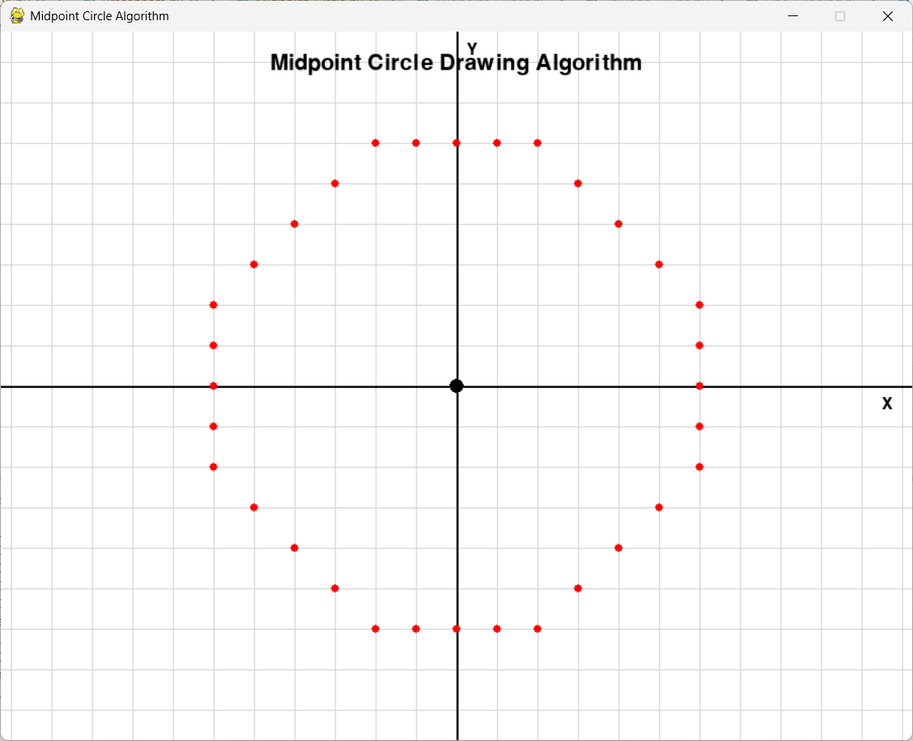
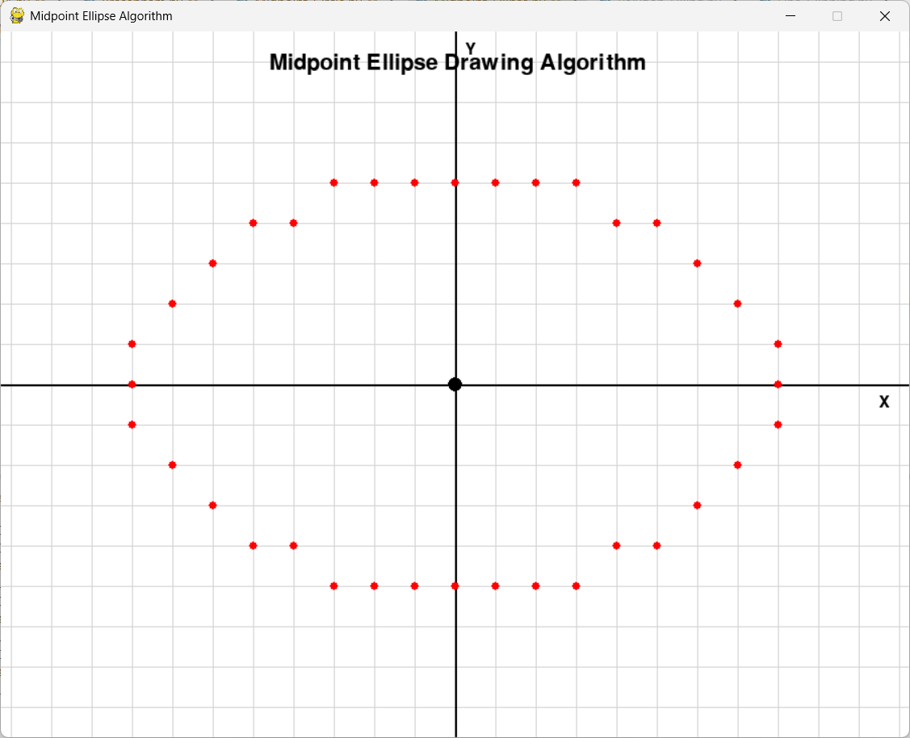
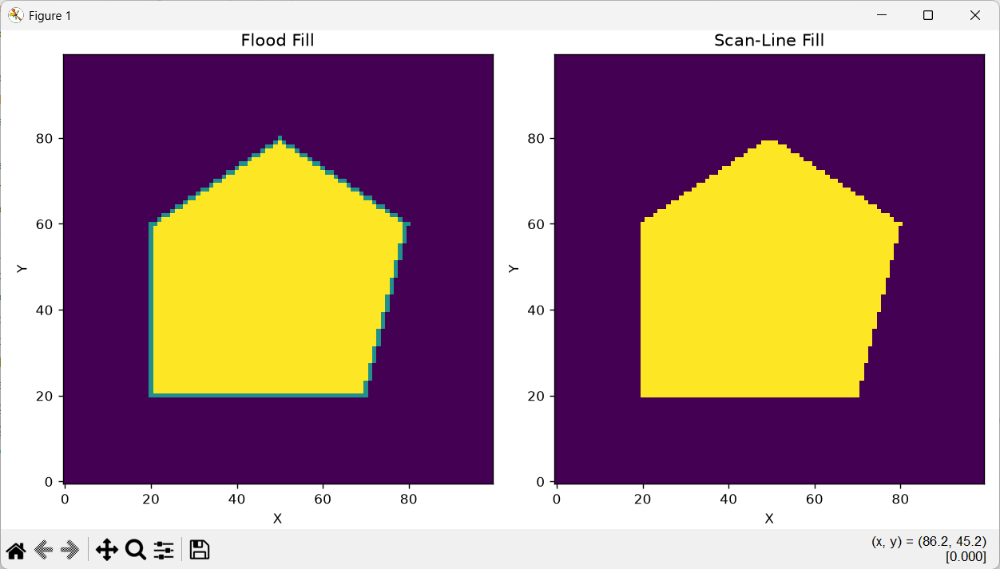
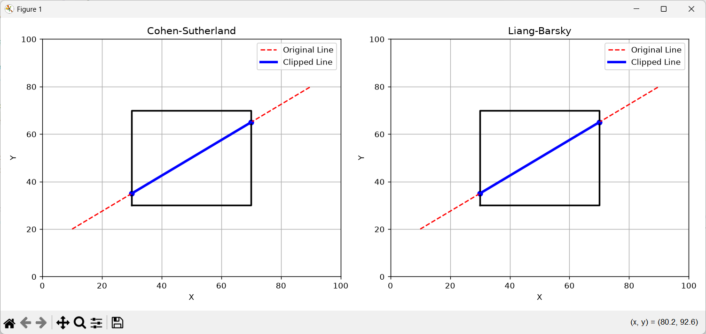
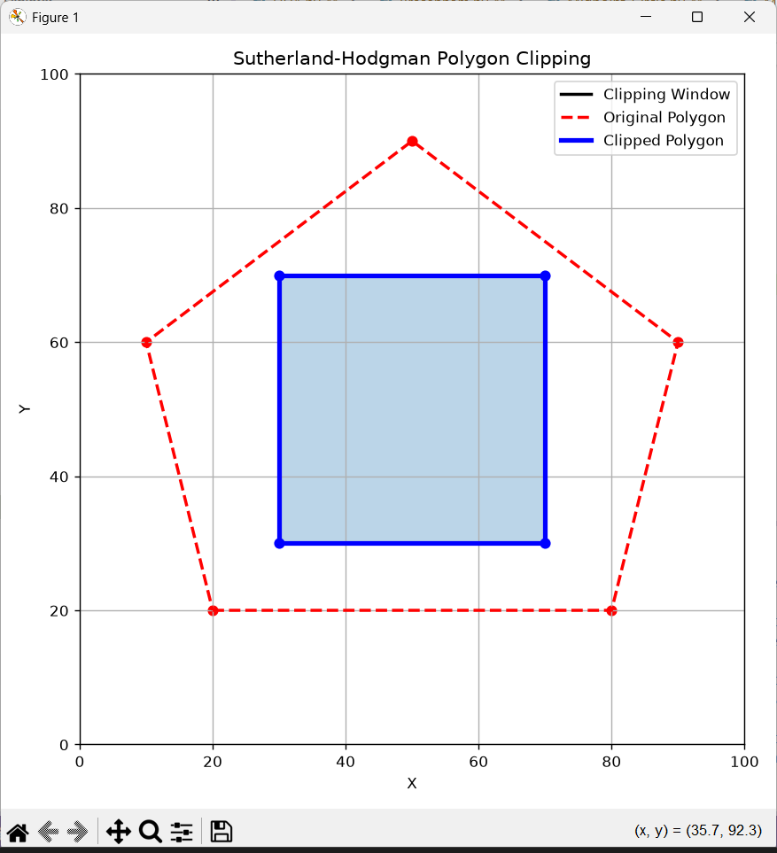

# Computer Graphics Algorithms

This repository contains implementations of fundamental Computer Graphics
algorithms using Python.

## Algorithms Implemented

1. DDA Line Drawing Algorithm
2. Bresenham's Line Drawing Algorithm
3. Midpoint Circle Drawing Algorithm
4. Midpoint Ellipse Drawing Algorithm
5. Polygon Filling
6. Line Clipping
7. Polygon Clipping

## Technologies Used

- Python
- Pygame
- NumPy
- Matplotlib

## Project Structure

```text
Computer_Graphics/
│
├── Algorithms/
│   ├── DDA.py
│   ├── Bresenham.py
│   ├── Midpoint_Circle.py
│   ├── Midpoint_Ellipse.py
│   ├── Polygon_Filling.py
│   ├── Line_Clipping.py
│   ├── Polygon_Clipping.py
│   │
│   └── Output/
│       ├── DDA.png
│       ├── Bresenham.png
│       ├── Midpoint_Circle.png
│       ├── Midpoint_Ellipse.png
│       ├── Polygon_Filling.png
│       ├── Line_Clipping.png
│       └── Polygon_Clipping.png
│
└── README.md

```text
## Output Screenshots

### DDA Line Drawing Algorithm



### Bresenham's Line Drawing Algorithm



### Midpoint Circle Drawing Algorithm



### Midpoint Ellipse Drawing Algorithm



### Polygon Filling



### Line Clipping



### Polygon Clipping

